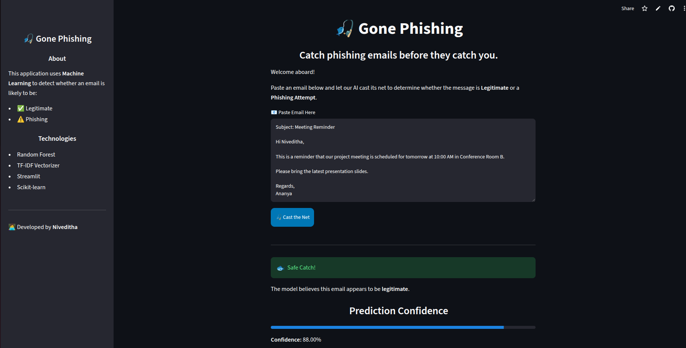
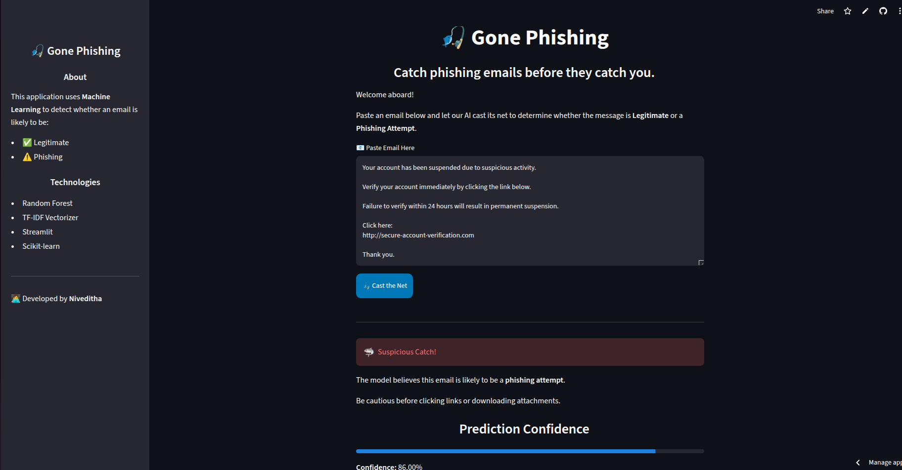

# 🎣 Gone Phishing

An AI-powered phishing email detection system that classifies emails as **Legitimate** or **Phishing** using Machine Learning. The application provides an interactive web interface built with Streamlit, allowing users to paste email content and receive instant predictions.

---

## 📌 Features

- Detects phishing and legitimate emails
- Text preprocessing using NLTK
- TF-IDF Vectorization
- Random Forest Classifier
- Prediction confidence score
- Interactive Streamlit web interface

---

## 🛠️ Technologies Used

- Python
- Pandas
- NumPy
- Scikit-learn
- NLTK
- Joblib
- Streamlit

---

## 📂 Project Structure

```
Gone-Phishing/
│
├── app.py
├── AI Driven Phishing Email Detection.ipynb
├── phishing_model.pkl
├── tfidf_vectorizer.pkl
├── requirements.txt
├── README.md
└── .gitignore
```

---

## 📊 Machine Learning Workflow

1. Load the phishing email dataset.
2. Clean and preprocess the email text.
3. Convert text into numerical features using TF-IDF.
4. Train multiple machine learning models.
5. Compare model performance.
6. Save the best-performing model.
7. Deploy using Streamlit.

---

## 🤖 Models Evaluated

- K-Nearest Neighbors (KNN)
- Logistic Regression
- Random Forest
- Multi-Layer Perceptron (MLP)

**Best Model:** Random Forest

---

## 🌐 Live Demo

**Streamlit App:** *(Add your Streamlit URL here)*

Example:

```
https://gone-phishing.streamlit.app
```

---

## 📷 Screenshots


### Legitimate Email Prediction



### Phishing Email Prediction



## 📚 Dataset

Phishing Email Dataset from Kaggle:

https://www.kaggle.com/datasets/naserabdullahalam/phishing-email-dataset

---

## 🔮 Future Enhancements

- Email file (.eml/.txt) upload support
- Highlight suspicious words
- Improved UI with custom HTML/CSS
- Animated cybersecurity dashboard
- Deep learning-based classification
- Explainable AI predictions

---

## 👩‍💻 Author

**Niveditha**

B.Tech Student

---

## 📄 License

This project was developed for educational and learning purposes.