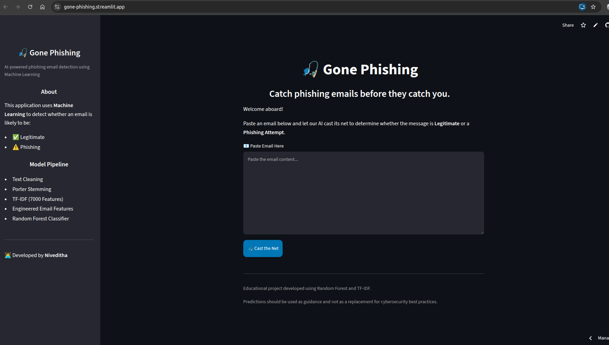
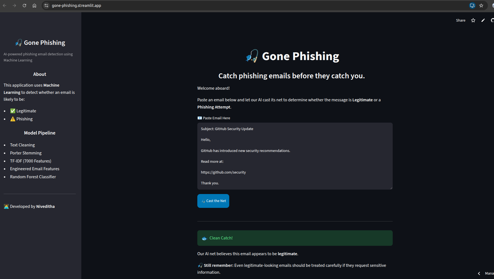
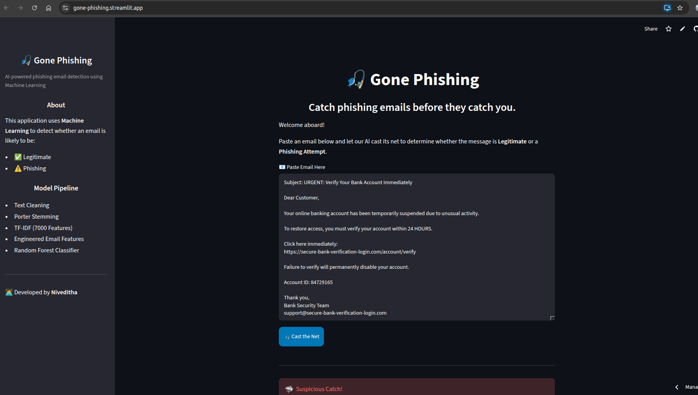

# 🎣 Gone Phishing

A machine learning-based phishing email detection system that classifies emails as Legitimate or Phishing. The project includes model training, evaluation, and deployment through an interactive Streamlit web application.
---

## 📌 Features

- Detects phishing and legitimate emails
- Email preprocessing using NLTK
- TF-IDF vectorization with engineered email features
- Comparison of multiple machine learning models
- Random Forest selected as the final deployed model
- Prediction confidence score
- Interactive Streamlit web interface
- Visual summary of extracted email features

---

## 🛠️ Technologies Used

- Python
- Pandas
- NumPy
- SciPy
- Scikit-learn
- NLTK
- Joblib
- Streamlit

---

## 📂 Project Structure

```
Gone-Phishing/
│
├── app.py
├── AI Driven Phishing Email Detection.ipynb
├── phishing_model.pkl
├── tfidf_vectorizer.pkl
├── requirements.txt
├── README.md
└── .gitignore
```

---

## 📊 Machine Learning Workflow

1. Load the phishing email dataset.
2. Clean and preprocess email text.
3. Extract textual and metadata-based features.
4. Generate TF-IDF vectors.
5. Combine TF-IDF with engineered email features.
6. Train and compare multiple machine learning models.
7. Evaluate models using Accuracy, Precision, Recall, F1-score and Confusion Matrices.
8. Save the best-performing model.
9. Deploy using Streamlit (optional).

---

## 🤖 Models Evaluated
- Logistic Regression
- Random Forest
- Naive Bayes
- Simple Neural Network (MLPClassifier)

**Best Model:** Random Forest

---

## 🌐 Live Demo

**Streamlit App:** 

```
https://gone-phishing.streamlit.app/
```

---

## 📷 Screenshots



### Legitimate Email Prediction



### Phishing Email Prediction



## 📚 Dataset

This project uses the **Phishing Email Dataset** available on Kaggle. The dataset contains phishing and legitimate emails collected from multiple publicly available sources and is used for training and evaluating the machine learning models.

https://www.kaggle.com/datasets/naserabdullahalam/phishing-email-dataset

---

## 🔮 Future Enhancements

- Email file (.eml/.txt) upload support
- Highlight suspicious words
- Improved UI with custom HTML/CSS
- Animated cybersecurity dashboard
- Deep learning-based classification
- Explainable AI predictions

---

## 👩‍💻 Author

**Niveditha N**

B.Tech Computer Science and Engineering Student

---

## 📄 License

This project was developed for educational and learning purposes.